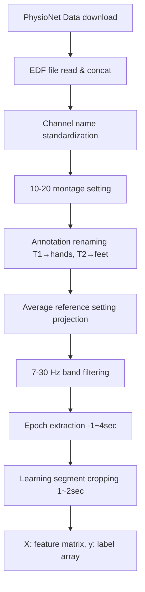

# Total Perspective Vortex

## Description

### Goal
- Process EEG datas (parsing and filtering)
- Implement a dimensionality reduction algorithm
- Use the pipeline object from scikit-learn
- Classify a data stream in "real time"

#### Architecture

### Cite
Schalk, G., McFarland, D.J., Hinterberger, T., Birbaumer, N., Wolpaw, J.R. BCI2000: A General-Purpose Brain-Computer Interface (BCI) System. IEEE Transactions on Biomedical Engineering 51(6):1034-1043, 2004.