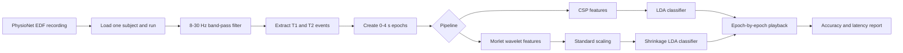

# Total Perspective Vortex

An EEG motor-task classification project built with the PhysioNet EEG Motor Movement/Imagery Dataset. It preprocesses EDF recordings, trains subject-specific binary classifiers, evaluates held-out runs, and replays EEG epochs one at a time to simulate real-time prediction.

## Features

- Supports subjects 1 through 109 and motor-task runs 3 through 14.
- Preprocesses EEG recordings with an 8–30 Hz band-pass filter and 0–4 second epochs.
- Provides a required CSP + LDA pipeline and an optional Morlet wavelet + LDA pipeline.
- Uses scikit-learn pipelines for training and inference.
- Prevents run-level data leakage by training on two runs from an experiment and testing on the remaining run.
- Reports prediction accuracy and per-epoch latency against a two-second constraint.
- Includes notebooks for data exploration, preprocessing, and pipeline experiments.

## Dataset and Experiments

The project uses the [EEG Motor Movement/Imagery Dataset](https://physionet.org/content/eegmmidb/1.0.0/), which contains 64-channel EEG recordings sampled at 160 Hz.

The supported binary experiments are:

| Experiment | Runs |
| --- | --- |
| Actual left fist vs. right fist | 3, 7, 11 |
| Imagined left fist vs. right fist | 4, 8, 12 |
| Actual fists vs. feet | 5, 9, 13 |
| Imagined fists vs. feet | 6, 10, 14 |

For a selected held-out run, the other two runs from the same experiment are used for training.

## Processing and Classification



### CSP pipeline (required)

The primary pipeline extracts four Common Spatial Pattern components, computes log-variance features, and classifies them with Linear Discriminant Analysis.

The CSP pipeline records at least 60% accuracy for every subject in the current evaluation results.

### Wavelet pipeline (optional)

The optional pipeline extracts Morlet wavelet band-power features over 8–30 Hz, standardizes them, and uses shrinkage LDA.

> **Performance note:** The Wavelet pipeline has not recorded at least 60% accuracy for every subject. Its accuracy varies by subject, so it should be treated as an experimental alternative rather than a replacement for the required CSP pipeline.

## Project Structure

```text
.
├── mybci.py                  # Training, prediction, and full-evaluation CLI
├── visualization.py         # Raw and filtered EEG visualization
├── requirements.txt
├── scripts/
│   ├── import_data.sh        # PhysioNet dataset download
│   └── bonus_demo.sh         # CSP/Wavelet training and prediction demo
├── src/
│   ├── preprocessing.py      # EDF loading, filtering, and epoch extraction
│   ├── csp.py                # CSP transformer
│   ├── pipeline.py           # Required CSP + LDA pipeline
│   ├── bonus_pipeline.py     # Optional Wavelet + LDA pipeline
│   ├── prediction.py         # Held-out playback and metrics
│   └── evaluation.py         # Experiment definitions and evaluation
└── notebook/                 # Exploration and pipeline notebooks
```

## Citation

Schalk, G., McFarland, D. J., Hinterberger, T., Birbaumer, N., & Wolpaw, J. R. (2004). BCI2000: A General-Purpose Brain-Computer Interface (BCI) System. *IEEE Transactions on Biomedical Engineering, 51*(6), 1034–1043.

## Usage

### 1. Set up the environment

Python 3.10 or later is recommended.

```bash
python -m venv .venv
source .venv/bin/activate
pip install -r requirements.txt
```

The download script also requires `wget`.

### 2. Download the dataset

Run the following command from the project root:

```bash
./scripts/import_data.sh
```

The EDF files are stored under `physionet.org/files/eegmmidb/1.0.0/`.

### 3. Train a model

The arguments are the subject ID, held-out run, and mode. CSP is selected by default.

```bash
python mybci.py 4 14 train
```

To train the optional Wavelet pipeline:

```bash
python mybci.py 4 14 train --pipeline wavelet
```

Trained artifacts are written to `models/`. The training command reports five-fold cross-validation scores, but final performance should be assessed on the held-out run.

### 4. Run held-out prediction

Use the same subject, held-out run, and pipeline used during training:

```bash
python mybci.py 4 14 predict
python mybci.py 4 14 predict --pipeline wavelet
```

Prediction prints each epoch's predicted and true label, overall accuracy, average latency, maximum latency, and whether the two-second latency constraint was satisfied.

### 5. Run the demo or full CSP evaluation

Run both pipelines for subject 4 with run 14 held out:

```bash
./scripts/bonus_demo.sh 4 14 all
```

The final argument may be `all`, `csp`, or `wavelet`. Demo logs are saved under `logs/`.

Run the required CSP held-out evaluation across all subjects and supported experiments:

```bash
python mybci.py
```

This full evaluation processes 109 subjects and can take a substantial amount of time.

### 6. Visualize a recording

```bash
python visualization.py 4 14
```

This opens interactive plots for the raw EEG, filtered EEG, and power spectral density.
