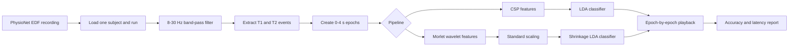

# Total Perspective Vortex

An EEG motor-task classification project built with the PhysioNet EEG Motor Movement/Imagery Dataset. It preprocesses EDF recordings, trains subject-specific binary classifiers, evaluates held-out runs, and replays EEG epochs one at a time to simulate real-time prediction.

## Features

- Supports subjects 1 through 109 and motor-task runs 3 through 14.
- Preprocesses EEG recordings with an 8–30 Hz band-pass filter and 0–4 second epochs.
- Provides a required CSP + LDA pipeline and an optional Morlet wavelet + LDA pipeline.
- Uses scikit-learn pipelines for training and inference.
- Evaluates six binary experiments with three held-out repetitions and disjoint training and test runs.
- Reports prediction accuracy and per-epoch latency against a two-second constraint.
- Includes notebooks for data exploration, preprocessing, and pipeline experiments.

## Dataset and Experiments

The project uses the [EEG Motor Movement/Imagery Dataset](https://physionet.org/content/eegmmidb/1.0.0/), which contains 64-channel EEG recordings sampled at 160 Hz.

For the six-experiment evaluation, this implementation uses:

| ID | Experiment | Repetitions | Classification target |
| --- | --- | --- | --- |
| 0 | Actual left fist vs. right fist | `(3)`, `(7)`, `(11)` | T1 vs. T2 events |
| 1 | Imagined left fist vs. right fist | `(4)`, `(8)`, `(12)` | T1 vs. T2 events |
| 2 | Actual fists vs. feet | `(5)`, `(9)`, `(13)` | T1 vs. T2 events |
| 3 | Imagined fists vs. feet | `(6)`, `(10)`, `(14)` | T1 vs. T2 events |
| 4 | Actual vs. imagined left/right fists | `(3, 4)`, `(7, 8)`, `(11, 12)` | Actual (`0`) vs. imagined (`1`) |
| 5 | Actual vs. imagined fists/feet | `(5, 6)`, `(9, 10)`, `(13, 14)` | Actual (`0`) vs. imagined (`1`) |

Each experiment uses three held-out folds. Experiments 0–3 hold out one run and train on the other two runs. Experiments 4–5 treat an actual/imagined run pair as one repetition: each fold holds out one pair and trains on the other two pairs. Training and test runs are disjoint in every fold.

## Processing and Classification


```mermaid
flowchart LR
    A[PhysioNet EDF recording] --> B[Load one subject and run]
    B --> C[8-30 Hz band-pass filter]
    C --> D[Extract T1 and T2 events]
    D --> E[Create 0-4 s epochs]
    E --> F{Pipeline}
    F --> G[CSP features]
    G --> H[LDA classifier]
    F --> I[Morlet wavelet features]
    I --> J[Standard scaling]
    J --> K[Shrinkage LDA classifier]
    H --> L[Epoch-by-epoch playback]
    K --> L
    L --> M[Accuracy and latency report]
```

### CSP pipeline (required)

The primary pipeline extracts four Common Spatial Pattern components, computes log-variance features, and classifies them with Linear Discriminant Analysis.

The mandatory acceptance metric is the equally weighted mean of the six experiment means on never-learned held-out data. The verified full evaluation achieved `0.680222`, above the required `0.60`. Individual experiments and subjects are not each required to exceed 60%.

### Verified mandatory results

The full CSP evaluation covered 109 subjects, six experiments, and three held-out folds per experiment:

```text
Successful evaluations: 1962
Errored evaluations: 0
Results per experiment: 327
Subjects with 18 results: 109/109
Mean accuracy of 6 experiments: 0.680222
```

| Experiment | Mean accuracy |
| --- | ---: |
| 0 | 0.666959 |
| 1 | 0.645281 |
| 2 | 0.771902 |
| 3 | 0.680918 |
| 4 | 0.662751 |
| 5 | 0.653518 |

The mandatory subject 4 / held-out R14 CLI smoke produced:

```text
Training runs: R6, R10
Cross-validation scores: 0.73333333, 0.66666667
Mean CV score: 0.7000
Held-out R14 accuracy: 0.8000
Average prediction latency per epoch: 0.0011 seconds
Maximum prediction latency: 0.0105 seconds
2-second latency constraint satisfied: True
```

### Wavelet pipeline (optional)

The optional pipeline extracts Morlet wavelet band-power features over 8–30 Hz, standardizes them, and uses shrinkage LDA.

> **Performance note:** The Wavelet pipeline has not recorded at least 60% accuracy for every subject. Its accuracy varies by subject, so it should be treated as an experimental alternative rather than a replacement for the required CSP pipeline.

## Project Structure

```text
.
├── mybci.py                  # Training, prediction, and full-evaluation CLI
├── visualization.py         # Raw and filtered EEG visualization
├── requirements.txt
├── scripts/
│   ├── import_data.sh        # PhysioNet dataset download
│   ├── mandatory_demo.sh     # Required CSP train/predict/full-evaluation demo
│   └── bonus_demo.sh         # CSP/Wavelet training and prediction demo
├── src/
│   ├── preprocessing.py      # EDF loading, filtering, and epoch extraction
│   ├── csp.py                # CSP transformer
│   ├── experiments.py        # Six experiment definitions and fold mapping
│   ├── pipeline/
│   │   ├── pipeline.py       # Required CSP + LDA pipeline
│   │   └── bonus_pipeline.py # Optional Wavelet + LDA pipeline
│   ├── prediction.py         # Held-out playback and metrics
│   └── evaluation.py         # Held-out evaluation orchestration
└── notebook/                 # Exploration and pipeline notebooks
```

## Citation

Schalk, G., McFarland, D. J., Hinterberger, T., Birbaumer, N., & Wolpaw, J. R. (2004). BCI2000: A General-Purpose Brain-Computer Interface (BCI) System. *IEEE Transactions on Biomedical Engineering, 51*(6), 1034–1043.

## Usage

### 1. Set up the environment

Python 3.10 or later is recommended.

```bash
python -m venv .venv
source .venv/bin/activate
pip install -r requirements.txt
```

The download script also requires `wget`.

### 2. Download the dataset

Run the following command from the project root:

```bash
./scripts/import_data.sh
```

The EDF files are stored under `physionet.org/files/eegmmidb/1.0.0/`.

### 3. Train a model

The arguments are the subject ID, held-out run, and mode. CSP is selected by default.

```bash
python mybci.py 4 14 train
```

To train the optional Wavelet pipeline:

```bash
python mybci.py 4 14 train --pipeline wavelet
```

Trained artifacts are written to `models/`. For `python mybci.py 4 14 train`, R14 resolves to the imagined-fists-vs-feet task and training uses R6/R10 only. `LeaveOneGroupOut` evaluates the whole CSP-to-LDA scikit-learn Pipeline with one training run held out at a time, producing two cross-validation scores. Final performance is then assessed separately on the never-learned R14 data.

### 4. Run held-out prediction

Use the same subject, held-out run, and pipeline used during training:

```bash
python mybci.py 4 14 predict
python mybci.py 4 14 predict --pipeline wavelet
```

Prediction prints each epoch's predicted and true label, overall accuracy, average latency, maximum latency, and whether the two-second latency constraint was satisfied.

### 5. Run the demo or full CSP evaluation

Run both pipelines for subject 4 with run 14 held out:

```bash
./scripts/bonus_demo.sh 4 14 all
```

The final argument may be `all`, `csp`, or `wavelet`. Demo logs are saved under `logs/`.

Run the required CSP held-out evaluation across all subjects and supported experiments:

```bash
python mybci.py
```

This full evaluation processes 109 subjects and can take a substantial amount of time.

### 6. Visualize a recording

```bash
python visualization.py 4 14
```

This opens interactive plots for the raw EEG, filtered EEG, and power spectral density.
