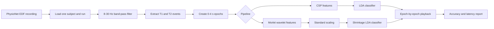

# Total Perspective Vortex

## Overview

Total Perspective Vortex is an EEG motor-task classification project built with the PhysioNet EEG Motor Movement/Imagery Dataset. It preprocesses EDF recordings, trains subject-specific binary classifiers, evaluates held-out runs, and replays EEG epochs one at a time to simulate prediction after an epoch has been supplied to the model.

## Features

- Supports subjects 1 through 109 and motor-task runs 3 through 14.
- Preprocesses EEG recordings with an 8–30 Hz band-pass filter and 0–4 second epochs.
- Provides a required CSP + LDA pipeline and an optional Morlet wavelet + LDA pipeline.
- Uses scikit-learn pipelines for training and inference.
- Evaluates six binary experiments with three held-out repetitions and disjoint training and test runs.
- Reports prediction accuracy and per-epoch latency against a two-second constraint.
- Includes notebooks for data exploration, preprocessing, and pipeline experiments.

## Dataset and Experiments

The project uses the [EEG Motor Movement/Imagery Dataset](https://physionet.org/content/eegmmidb/1.0.0/), which contains 64-channel EEG recordings sampled at 160 Hz.

The exact six-experiment mapping below is this implementation's evaluation design. Experiments 0–3 classify event labels T1 versus T2. Experiments 4–5 classify recording modality—actual (`0`) versus imagined (`1`)—by pairing corresponding actual and imagined runs; this pairing is an evaluation choice in the code.

| ID | Experiment | Repetitions | Classification target |
| --- | --- | --- | --- |
| 0 | Actual left fist vs. right fist | `(3)`, `(7)`, `(11)` | T1 vs. T2 events |
| 1 | Imagined left fist vs. right fist | `(4)`, `(8)`, `(12)` | T1 vs. T2 events |
| 2 | Actual fists vs. feet | `(5)`, `(9)`, `(13)` | T1 vs. T2 events |
| 3 | Imagined fists vs. feet | `(6)`, `(10)`, `(14)` | T1 vs. T2 events |
| 4 | Actual vs. imagined left/right fists | `(3, 4)`, `(7, 8)`, `(11, 12)` | Actual (`0`) vs. imagined (`1`) |
| 5 | Actual vs. imagined fists/feet | `(5, 6)`, `(9, 10)`, `(13, 14)` | Actual (`0`) vs. imagined (`1`) |

Each experiment uses three held-out folds. Experiments 0–3 hold out one run and train on the other two runs. Experiments 4–5 treat an actual/imagined run pair as one repetition: each fold holds out one pair and trains on the other two pairs. Training and test runs are disjoint in every fold.

## Design Rationale

### Why 8–30 Hz?

Motor movement and motor imagery are commonly associated with sensorimotor mu and beta rhythms. Filtering to 8–30 Hz focuses this implementation on a task-relevant range while reducing unrelated low-frequency drift and high-frequency noise before feature extraction. Useful neural information may also exist outside this interval: the filter is a design choice in this project, not a fixed numerical band explicitly mandated by the subject.

### Why Epoching?

The recordings are continuous, but their annotations identify when task events occur. The preprocessing code converts these annotations into sample-based events, retains T1 and T2, and extracts fixed 0–4 second epochs. Each epoch therefore associates one EEG segment with a task event and produces a fixed-length labeled sample for supervised classification. Feeding the full continuous recording to a classifier would mix task activity with rest periods and unrelated signal.

### Why CSP?

Motor-related EEG information is spatially distributed across electrodes rather than isolated in one channel. Because scalp electrodes measure mixtures of neural activity, discrimination can require weighted combinations of channels. Common Spatial Patterns (CSP) is the supervised linear spatial feature extractor used for that purpose.

For every training epoch, CSP estimates a channel covariance matrix. Covariance captures both individual-channel variance and relationships between channels. The implementation trace-normalizes each epoch covariance, averages the normalized matrices within each class, and applies diagonal regularization for numerical stability. It then solves:

\[
C_0 w = \lambda (C_0 + C_1) w
\]

Here, \(w\) is a spatial filter and \(w^T X\) projects a multichannel epoch \(X\) into one spatial component. The projected variance is \(w^T C w\). \(\lambda\) can be read as the class-0 projected-variance share relative to the combined projected variance: values near one identify class-0-dominant directions, while values near zero identify class-1-dominant directions. The implementation consequently retains eigenvectors from both extremes, then converts the projected components to log-variance features.

### Why LDA after CSP?

CSP reduces a high-dimensional epoch to a small set of discriminative log-variance features. Linear Discriminant Analysis (LDA) then learns a linear decision boundary in that feature space. This division of work keeps the required pipeline relatively simple and interpretable: CSP performs spatial feature extraction, and LDA performs final classification. It does not imply that LDA is universally optimal.

### Why Run-Level Holdout?

Epochs from one recording can share run- or session-specific properties. Randomly mixing epochs from the same run into training and test data could therefore yield overly optimistic results. The evaluation instead keeps a held-out run—or, for modality experiments, a held-out actual/imagined repetition pair—completely unseen during training.

For single-run CLI training, `LeaveOneGroupOut` cross-validation groups epochs by run. Cross-validation receives the complete scikit-learn pipeline, so CSP is fitted only on each training fold and does not see validation-fold data. Final performance is assessed separately on the never-learned held-out run.

## Processing and Classification


```mermaid
flowchart LR
    A[PhysioNet EDF recording] --> B[Load one subject and run]
    B --> C[8-30 Hz band-pass filter]
    C --> D[Extract T1 and T2 events]
    D --> E[Create 0-4 s epochs]
    E --> F{Pipeline}
    F --> G[CSP features]
    G --> H[LDA classifier]
    F --> I[Morlet wavelet features]
    I --> J[Standard scaling]
    J --> K[Shrinkage LDA classifier]
    H --> L[Epoch-by-epoch playback]
    K --> L
    L --> M[Accuracy and latency report]
```

### Required CSP + LDA Pipeline

The required pipeline is a scikit-learn `Pipeline` containing CSP with four components followed by LDA. During fitting, it learns class-specific spatial filters from training epochs; during transformation, it produces four log-variance features per epoch for LDA.

### Optional Wavelet Pipeline

EEG is non-stationary, so its frequency content can vary over time. A Fourier-style global spectrum loses temporal localization. A Morlet wavelet provides time-frequency localization through a complex sinusoid modulated by a Gaussian envelope.

The optional, experimental pipeline computes a Morlet continuous wavelet transform (CWT) over integer frequencies in the 8–30 Hz region. It uses complex coefficients, computes power as \(|\mathrm{coefficient}|^2\), aggregates power within mu (8–13 Hz), low-beta (13–20 Hz), and high-beta (20–31 Hz) bands for each channel, and log-transforms the resulting band-power features. With the default frequency grid, the high-beta aggregation contains the 20–30 Hz samples. `StandardScaler` precedes shrinkage LDA (`solver='lsqr'`, `shrinkage='auto'`).

> **Performance note:** The Wavelet pipeline has not recorded at least 60% accuracy for every subject. Its accuracy varies by subject, so it should be treated as an experimental alternative rather than a replacement for the required CSP pipeline.

## Evaluation Strategy

The mandatory acceptance metric is the equally weighted mean of the six experiment means on never-learned held-out data. The verified full evaluation achieved `0.680222`, above the required `0.60`. Individual experiments and subjects are not each required to exceed 60%.

For the full evaluation, each subject's supported runs are preprocessed once and then combined according to the six experiment definitions. A fresh required CSP + LDA pipeline is fit on each fold's training data and scored only on its disjoint held-out run or pair.

## Verified Mandatory Results

The full CSP evaluation covered 109 subjects, six experiments, and three held-out folds per experiment:

```text
Successful evaluations: 1962
Errored evaluations: 0
Results per experiment: 327
Subjects with 18 results: 109/109
Mean accuracy of 6 experiments: 0.680222
```

| Experiment | Mean accuracy |
| --- | ---: |
| 0 | 0.666959 |
| 1 | 0.645281 |
| 2 | 0.771902 |
| 3 | 0.680918 |
| 4 | 0.662751 |
| 5 | 0.653518 |

The mandatory subject 4 / held-out R14 CLI smoke produced:

```text
Training runs: R6, R10
Cross-validation scores: 0.73333333, 0.66666667
Mean CV score: 0.7000
Held-out R14 accuracy: 0.8000
Average prediction latency per epoch: 0.0011 seconds
Maximum prediction latency: 0.0105 seconds
2-second latency constraint satisfied: True
```

## Project Structure

```text
.
├── mybci.py                  # Training, prediction, and full-evaluation CLI
├── visualization.py          # Raw and filtered EEG visualization
├── Makefile                  # Setup, downloads, execution, and test automation
├── requirements.txt
├── scripts/
│   ├── import_data.sh        # PhysioNet dataset download
│   ├── mandatory_demo.sh     # Required CSP train/predict/full-evaluation demo
│   └── bonus_demo.sh         # CSP/Wavelet training and prediction demo
├── src/
│   ├── preprocessing.py      # EDF loading, filtering, and epoch extraction
│   ├── csp.py                # CSP transformer
│   ├── experiments.py        # Six experiment definitions and fold mapping
│   ├── pipeline/
│   │   ├── pipeline.py       # Required CSP + LDA pipeline
│   │   └── bonus_pipeline.py # Optional Wavelet + LDA pipeline
│   ├── prediction.py         # Held-out playback and metrics
│   └── evaluation.py         # Held-out evaluation orchestration
└── notebook/                 # Exploration and pipeline notebooks
```

## Usage

### 1. Set up the environment

Python 3.10 or later is recommended.

```bash
python -m venv .venv
source .venv/bin/activate
pip install -r requirements.txt
```

The download script also requires `curl`.

### 2. Download the dataset

Run the following command from the project root:

```bash
./scripts/import_data.sh
```

Or use the Makefile:

```bash
make download-data
```

For the Subject 4 / held-out R14 demo, download only the three runs needed for that task (R6, R10, and R14):

```bash
make download-sample SUBJECT_ID=4 RUN_ID=14
```

The EDF files are stored under `physionet.org/files/eegmmidb/1.0.0/`.

### 3. Train a model

The arguments are the subject ID, held-out run, and mode. CSP is selected by default.

```bash
python mybci.py 4 14 train
```

To train the optional Wavelet pipeline:

```bash
python mybci.py 4 14 train --pipeline wavelet
```

Trained artifacts are written to `models/`. For `python mybci.py 4 14 train`, R14 resolves to the imagined-fists-vs-feet task and training uses R6/R10 only. `LeaveOneGroupOut` evaluates the whole CSP-to-LDA scikit-learn pipeline with one training run held out at a time, producing two cross-validation scores. Final performance is then assessed separately on the never-learned R14 data.

### 4. Run held-out prediction

Use the same subject, held-out run, and pipeline used during training:

```bash
python mybci.py 4 14 predict
python mybci.py 4 14 predict --pipeline wavelet
```

Prediction prints each epoch's predicted and true label, overall accuracy, average latency, maximum latency, and whether the two-second latency constraint was satisfied.

### 5. Run the demo or full CSP evaluation

Run both pipelines for subject 4 with run 14 held out:

```bash
./scripts/bonus_demo.sh 4 14 all
```

The final argument may be `all`, `csp`, or `wavelet`. Demo logs are saved under `logs/`.

Run the required CSP held-out evaluation across all subjects and supported experiments:

```bash
python mybci.py
```

This full evaluation processes 109 subjects and can take a substantial amount of time.

### 6. Visualize a recording

```bash
python visualization.py 4 14
```

This opens interactive plots for the raw and filtered EEG. It saves the filtered power spectral density as `results/filtered_eeg_psd_S004R14.png` without displaying it interactively.

## Makefile Automation

The project Makefile provides shortcuts for environment setup, downloads, visualization, model execution, the six-experiment evaluation, and tests. Run `make` or `make help` to list all available targets. Commands use the project virtual environment at `.venv/bin/python` by default.

Create the virtual environment and install dependencies:

```bash
make setup
```

Download the PhysioNet EEGMMIDB dataset:

```bash
make download-data
```

Models are generated locally with `make train`; they are saved under `models/` using the subject, held-out run, and pipeline in the filename.

### Visualization

Subject 4 and run 14 are the defaults:

```bash
make visualize
```

Override them with Make variables when needed:

```bash
make visualize SUBJECT_ID=10 RUN_ID=8
```

Visualization opens interactive windows and therefore requires a graphical environment.

### Train and predict with `mybci.py`

Run the subject 4 demo separately from the full six-experiment evaluation:

```bash
# Subject 4: train and predict with held-out run 14
make evaluate-4

# All 109 subjects and all six experiments
make evaluate-6
```

`evaluate-4` uses the CSP pipeline by default. Select the Wavelet pipeline or a different held-out run with variables:

```bash
make evaluate-4 PIPELINE=wavelet RUN_ID=14
```

Training and prediction can also be invoked independently:

```bash
make train SUBJECT_ID=4 RUN_ID=14 PIPELINE=csp
make predict SUBJECT_ID=4 RUN_ID=14 PIPELINE=csp
```

The prediction target expects the corresponding model to have been trained first. `make evaluate-6` can take substantial time because it runs the complete held-out evaluation.

### Tests

Run all tests or only the Wavelet tests:

```bash
make test
make test-wavelet
```

Use `PYTHON=/path/to/python` to run the targets with a different Python interpreter.

## Design Trade-offs and Limitations

- The 8–30 Hz filter intentionally discards information outside the selected band.
- CSP is a linear spatial method and cannot model arbitrary nonlinear relationships.
- Models are trained and evaluated subject by subject; the implementation does not provide a cross-subject model.
- The Wavelet pipeline creates more features—three band-power features for each channel—and adds transform complexity.
- Simulated playback measures prediction latency only after a prepared epoch/chunk is supplied to the processing pipeline; it is not a complete live-acquisition system.

## Citation

Schalk, G., McFarland, D. J., Hinterberger, T., Birbaumer, N., & Wolpaw, J. R. (2004). BCI2000: A General-Purpose Brain-Computer Interface (BCI) System. *IEEE Transactions on Biomedical Engineering, 51*(6), 1034–1043.
